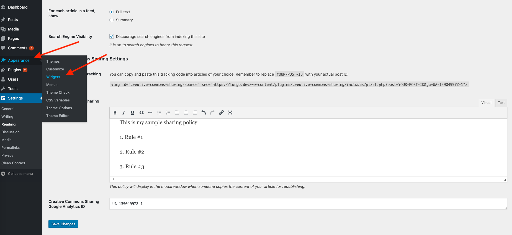
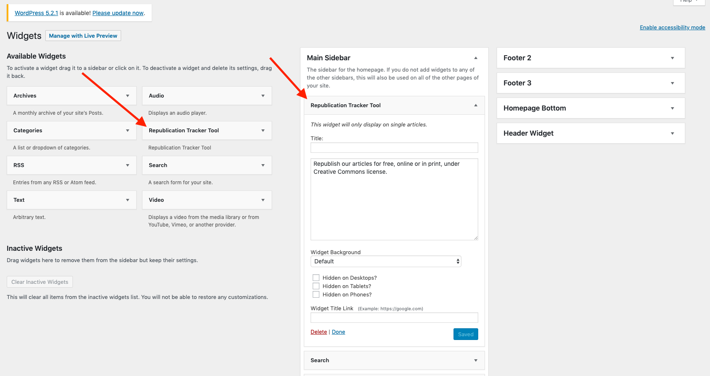
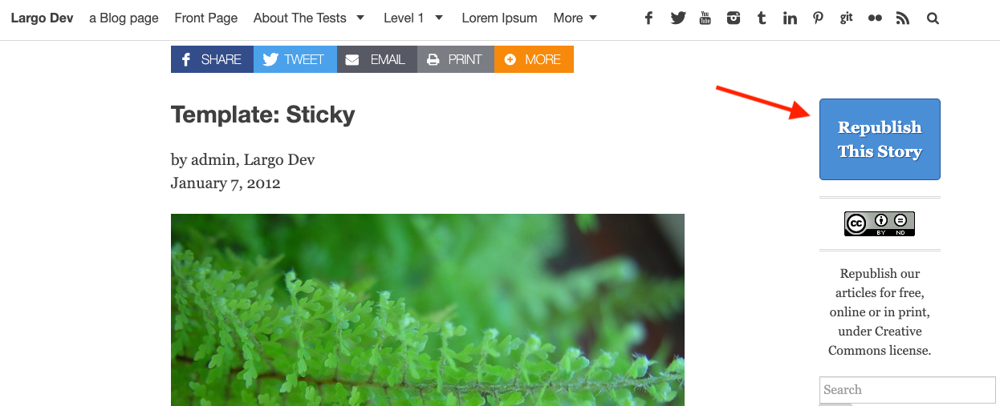

# Adding Republish button to posts

In order to add your `Republish` button to your posts, you will need to add the `Republication Tracker Tool` widget to the sidebar or widget area of your choice. Once this plugin is installed and activated, navigate to `Appearance` -> `Widgets`.

Find the `Republication Tracker Tool` widget and drag it into the widget area that you want it to appear in. You will be able to set these fields:

- Title
- Title Link
- Content
- Background
- Hidden on Desktop/Tablet/Phones

Once you have added the `Republication Tracker Tool` widget to a widget area, you should see the `Republish This Story` button appear on your selected widget area.

If you'd like to place the republication button within a post, but not in a sidebar, INN Labs' [Super Cool Ad Inserter Plugin](https://largo.inn.org/guides/administrators/plugins/super-cool-ad-inserter-plugin/) may be of use to you.
