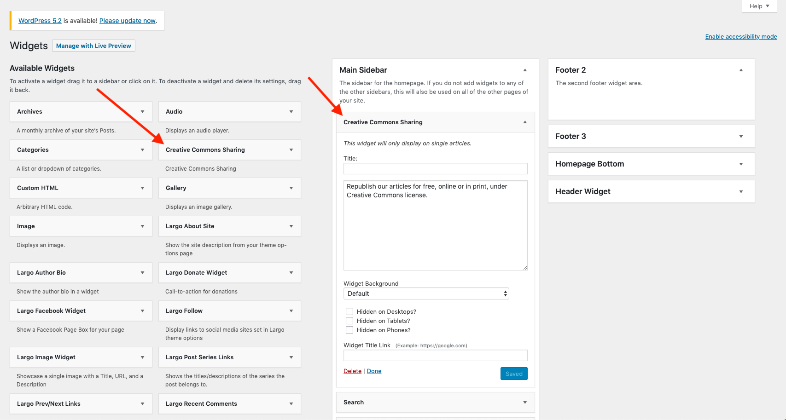

# Adding Republish button to posts

In order to add your `Republish` button to your posts, you will need to add the `Creative Commons Sharing` widget to the sidebar/widget area of your choice. Once the plugin is installed and activated, navigate to `Appearance` -> `Widgets`.

Find the `Creative Commons Sharing` widget and drag it into the widget area that you want it to appear in. You will be able to set these fields:
- Title
- Title Link
- Content
- Background
- Hidden on Desktop/Tablet/Phones

