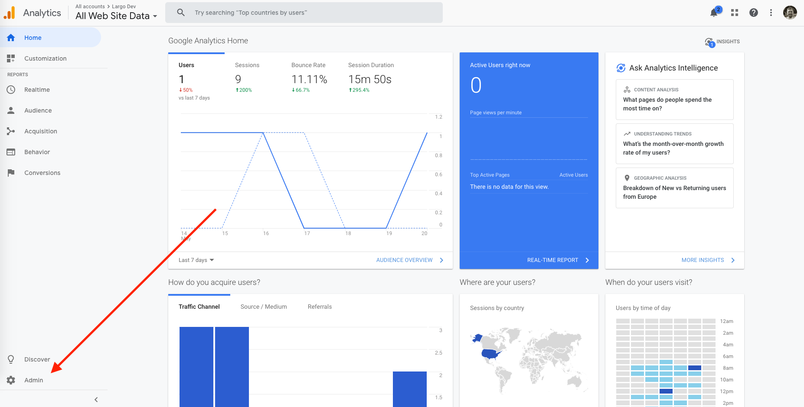
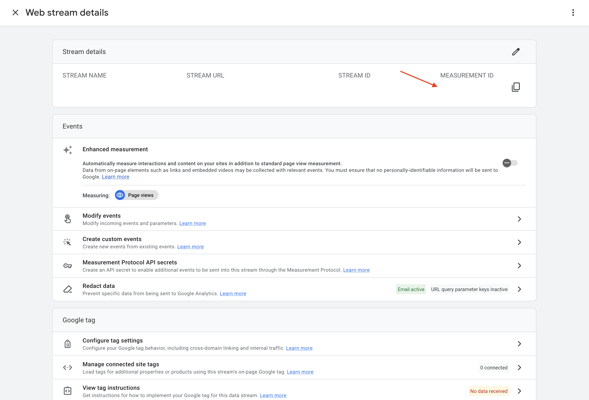
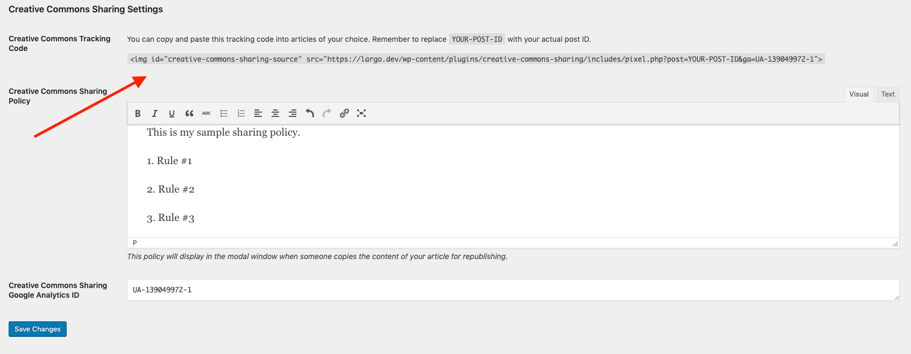
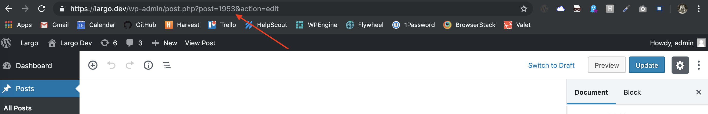

# Configuring Plugin Settings

To configure the settings for the Creative Commons Sharing plugin, navigate to the `Settings` -> `Reading` inside of your WordPress admin panel once the plugin is installed
and activated.

## Creative Commons Sharing Policy

The `Creative Commons Sharing Policy` field is where you will be able to input your rules and policies for users to see before they copy and paste your content to republish. A good example of a CCS policy can be found [here](https://www.propublica.org/steal-our-stories/).

## Creative Commons Sharing Google Analytics ID

In order to track your republished post pageviews in Google Analytics, you will need to insert your Google Analytics tracking ID into the field labeled `Creative Commons Sharing Google Analytics ID`.

To find your Google Analytics ID, first log into your Google Analytics account. Once logged in, click the `Admin` button on the bottom left corner.

Once inside the admin panel, click into `Property Settings` for the property you want the tracking ID for.

Inside of the `Property Settings` pane is where you will see your tracking ID.

## Creative Commons Tracking Code

Once you have your Google Analytics ID set, you'll be able to view a sample tracking code that you will be able to copy and paste in order to manually insert into specific types of articles that you'd like to track. Just remember to swap out `YOUR-POST-ID` with the actual ID of the post you're going to insert the pixel into.

To find the ID of your post that you'd like to use, navigate to the edit page for the specific post. Once on the editor page, you can grab your post ID from the `post` parameter in the url.

