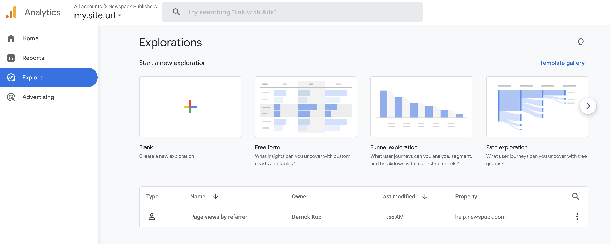
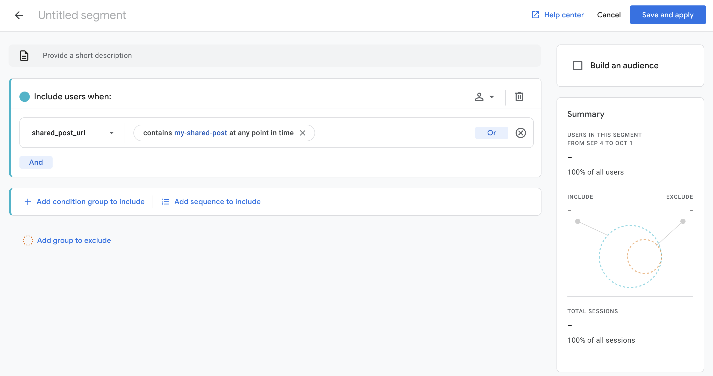
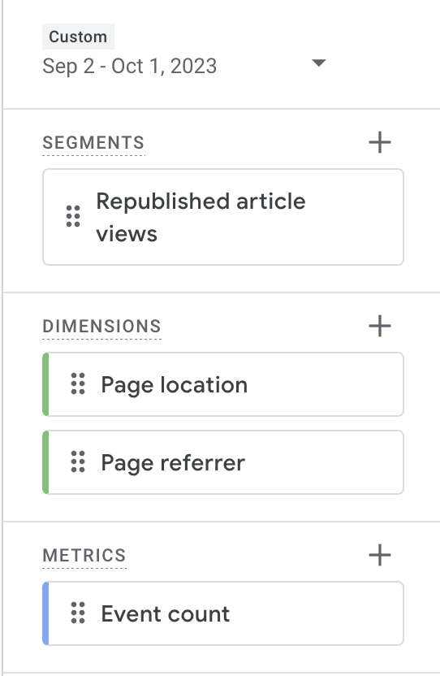
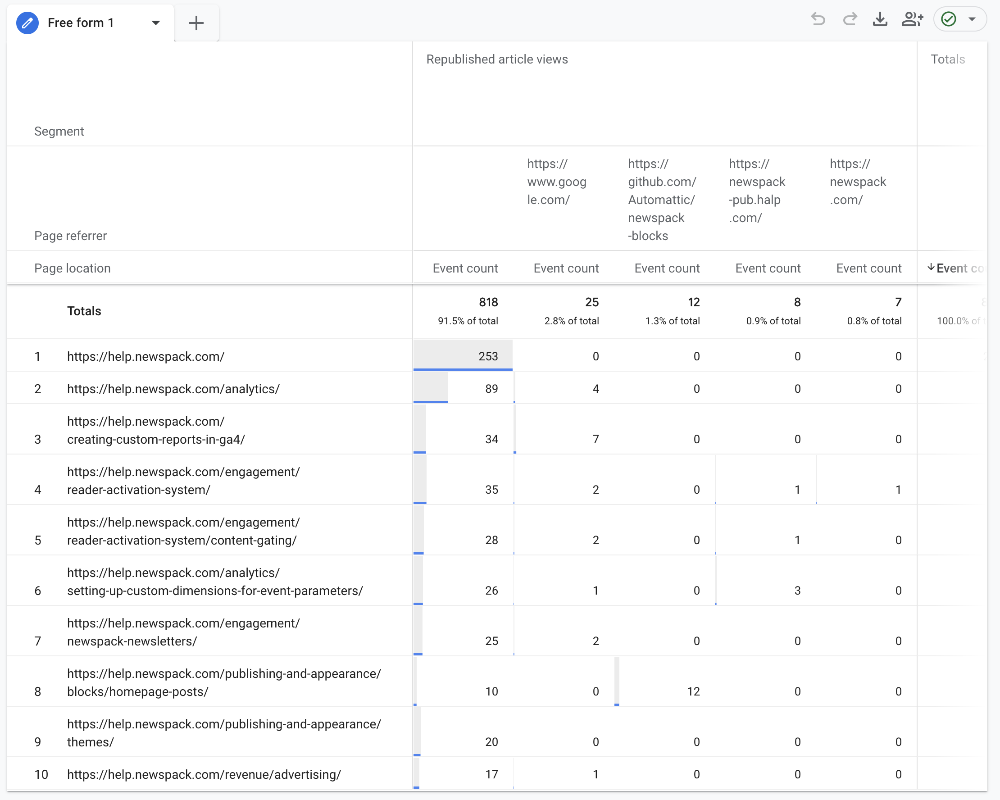
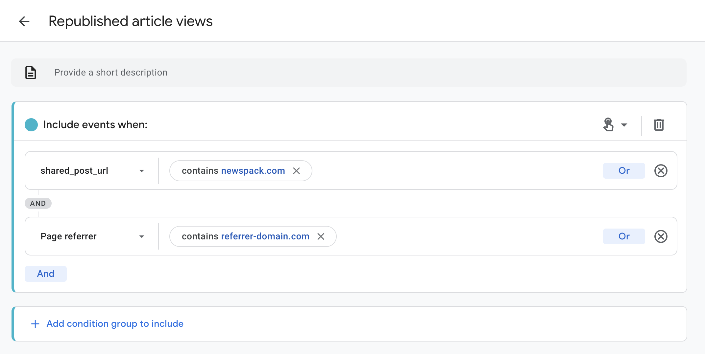

# Tracking Republished Posts

In order to use Google Analytics 4 to view tracking metrics for posts that have been republished, make sure you have your Google Analytics ID and API Secret set in the [Republication Tracker Tool Google Analytics ID](configuring-plugin-settings.md) settings field.

## Pageview events

Metrics for republished/shared posts are tracked as `page_view` events in Google Analytics 4. The `page_view` event includes the following parameters:

- `page_location`/`shared_post_url`: URL where the post was originally published (ex: https://yoursite.com/story-1)
- `shared_post_id`: WP post ID on the site where it was originally published.
- `shared_post_slug`: WP post slug on the site where it was originally published.
- `page_referrer`: URL where the post was republished (ex: https://nytimes.com/story-1)
- `page_title`: Title of the page where the post was republished (ex: Story Title)

## See How Stories are Performing

In order to see how stories are performing, you’ll need to log into your Google Analytics account. Once logged into your dashboard, select the “Explore” tab on the left sidebar. Once the “Explore” pane opens up, select “Blank” to create a new Exploration report. 

Once inside the new Exploration, you'll need to add a Segment of users to analyze, and Dimensions and Metrics to display. To view a report of articles that were shared via this plugin, click the + button next to the Segments panel and create a new User segment. Add a new Condition with a `shared_post_url` containing part or all of the URL of the post you want to view metrics for.

Here you can enter a value that will return multiple articles (such as your root domain or a category slug to view all republished articles on the site or in a specific category) or a particular story (such as the post slug for the story). 

Give your Segment a memorable name such as “Republished article views.” Click “Save and apply” to save your new segment.

Click the + button in the Dimensions panel to add the following dimensions to your Exploration:

- Page location
- Page referrer

Click the + button in the Metrics panel to add a single metric for “Event count”.

In the Settings column, you can choose Visualization options. For example, to view a table of articles that were republished with a breakdown of page views by shared URL, choose the following:

- Technique: Free form
- Visualization: Table
- Segment Comparisons: Your user segment as created above
- Rows: Page location
- Columns: Page referrer (this will show each shared URL in its own column of the report)
- Values: Event count

This will give you a report that looks similar to the following, where the left-most column will show the original URL for each shared article, and each shared URL will be shown in its own column:

## See what a particular site has republished (what did the NYT republish from our site?)

You can also drill down in more detail by adding additional conditions to your Segment. For example, to view a report of only page views by a specific referrer domain or URL, add a condition targeting **Page referrer** containing the domain or URL you want to search for:

