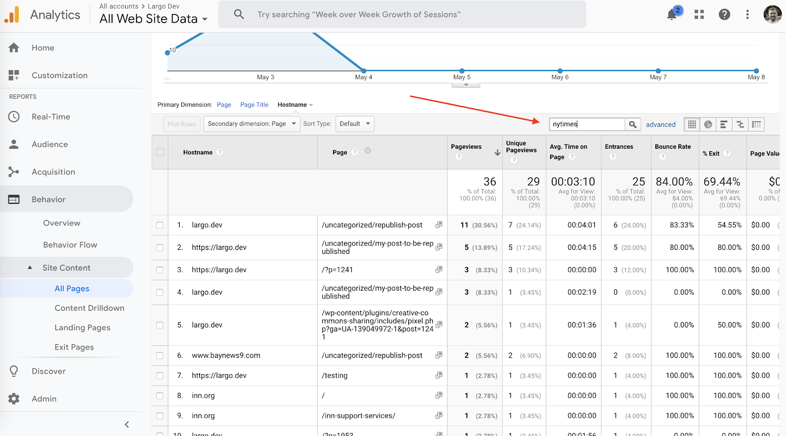

# Tracking Republished Posts

In order to use Google Analytics to view tracking metrics for posts that have been republished, make sure you have your Google Analytics ID set in the [Republication Tracker Tool Google Analytics ID](configuring-plugin-settings.md) settings field.

## Parameters Passed into Each Pageview

- Event: Pageview
- Page: Path of the post that was republished (ex: republish-story-origin)
- Document Location: URL of where the post was republished (ex: https://nytimes.com/story-1)
- Document Host: Domain of where the post was republished (ex: https://nytimes.com)
- Document Path: Path of where the post was republished (ex: story-1)
- Document Referrer: URL of where the post was republished (ex: https://nytimes.com/story-1)
- Document Title: Title of the page where the post was republished (ex: Story Title)

## See How a Particular Story is Performing

In order to see how a particular story is performing, you’ll need to log into your Google Analytics account. Once logged into your dashboard, select the “Behavior” tab on the left sidebar. Once the “Behavior” pane opens up, select “Site Content”. 

Once inside the “Site Content” tab, you can click on any page you’d like to see the performance for. 

Once you have clicked into a specific page, select “Secondary Dimension”. If you’d like to view a list of all the different sites that have republished this certain page, select “Hostname” for your “Secondary Dimension”. If you’d like to see the full url of the page that the story has been republished on, select “Full Referrer” as your “Secondary Dimension”.

## See what a particular site has republished (what did the NYT republish from our site?)

In order to see how a particular story is performing, you’ll need to log into your Google Analytics account. Once logged into your dashboard, select the “Behavior” tab on the left sidebar. Once the “Behavior” pane opens up, select “Site Content”. 

Once inside of the “Site Content” tab, set your “Primary Dimension” to “Hostname”. This will set your “Page Content” to be searchable by republishers.

After you have your “Primary Dimension” set, go ahead and set your “Secondary Dimension” as “Page”. 

Once you have “Hostname” and “Page” set as your dimensions, you’ll be able to use the Search input on the upper right side to be able to search for what domain you’re interested in seeing data for.

